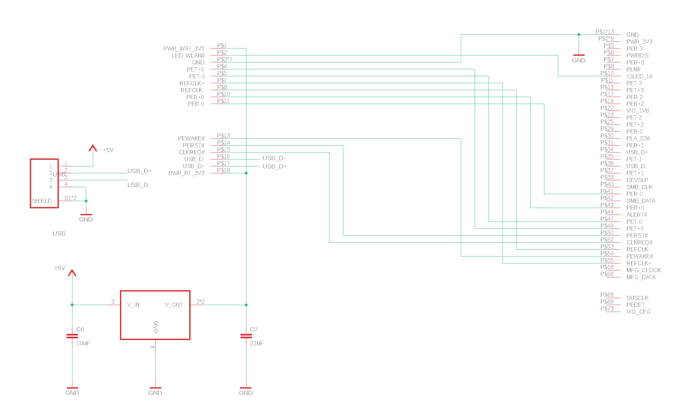

# M.2 key M to WiFi Adapter

## Problem:

Modern Intel mobos have CNVi socket for WiFi modules, but no M.2 key A/E slot. The only possibility to use Apple WiFi module, is to utilize existing M.2 key M socket. There are adapters exist, but all these adapters share one single problem - WiFi module is powered by PCI-E 3v3 power. It means, that during standby (sleep), module will lost the power and will be disconnected. On wake, module will be powered back again and will restart then. It takes a lot of time to start the module, and to reconnect all peripherals. Sometimes, module does not start correctly and needs to be reset.

## Solution:

To solve this problem, WiFi module needs to be constantly powered, even in the standby mode. There's only 5v standby power available on modern PSUs, so this adapter uses 5v standby power line to power the module. As USB 2 connection needed for BT to operate normally, the same USB connection is used as well to power the module, utilizing USB 2 5v power line. Since this line uses 5v standby, the power required is still available in standby/sleep modes. To produce required 3v3 from the 5v USB 2 voltage, the adapter has 5v to 3v3 converter, that powers WiFi module in all power states.

## Parts and components:

For USB connection, ordinary 4 pins surface mount JST 1mm pitch conector is used. For WiFi module, Apple Airport surface mount connector is used. Both are available for purchase in online stores. The proposed schematic uses LDO to produce 3v3 from USB 5v, as buck converter can make unwanted EMI, that could potentially affect PCI-E bus or wireless communications. 1.2 A 3v3 LDO, like LDL1117S33R, is used, but any other 3v3 LDO in SOT-223 package, like AMS1117, will work fine as well.

